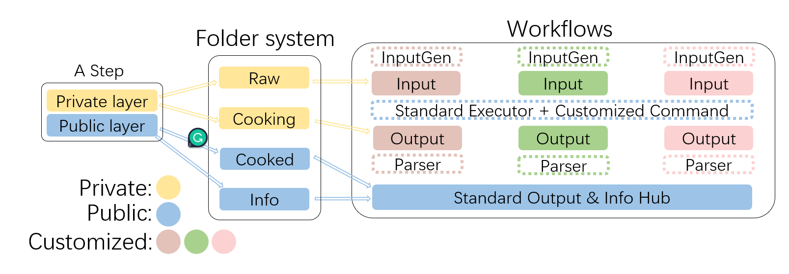

# AutoRefiner

Automated refinement procedure integrating multi-calculators for high-throughput molecular screening.

## Introduction

It’s a common strategy to combine different calculators in a sequential order to achieve global energy minima geometry or determine the energetically favored isomers. However, manual intervention is needed to effectively integrate different calculators. AutoRefiner automates the whole refinement process by modularizing different calculators to standard refiners.

Current test results demonstrate that AutoRefiner is capable of performing: 

1. Conformation search with ABCluster, xTB, and Gaussian.
2. Isomer screen with ASE, xTB, and Gaussian.

## Architecture

Figure 1 is the architecture of AutoRefiner. The key idea of integrating different calculators is to unify the output format for every calculator. It’s achieved by OP Parser. The executor role is assigned to OP build and exe.

Figure 1. Architecture of AutoRefiner 

A typical refiner workflow is shown in Figure 2.

Figure 2. A typical refiner workflow 

## Requirements

Dependencies are listed as below:

* dflow python package
* ASE python package
* Pandas
* A image containing these package (Pull franklalalala/py_autorefiner)
* A remote containing executable Gaussian, xTB, ABCluster softerware

Password in test files will be deleted in 3 days.

## Modules

Some parameters are dumped into dicts to keep interface clean. These parameters are pre-fixed before workflow submission. The important ones are kept for slice feature.

### inputGen module

To generate input files and perform energy cutoff. They are assigned to build the ‘raw’ folder.

### build module

They are assigned to build the workbase. Each input file as well as its auxiliary (if there is one) input file are put into a unique workbase. 

### calculators

They are in charge of execute input files with assist of dflow’s executor. The batch one are designed for parallel execution.

### parser

As the name suggested, they parse calculators’ results to standard format.

### refiners

Inherited from steps class, serve as templates.

----

A detailed description is coming soon.

Contact me: 1660810667@qq.com
